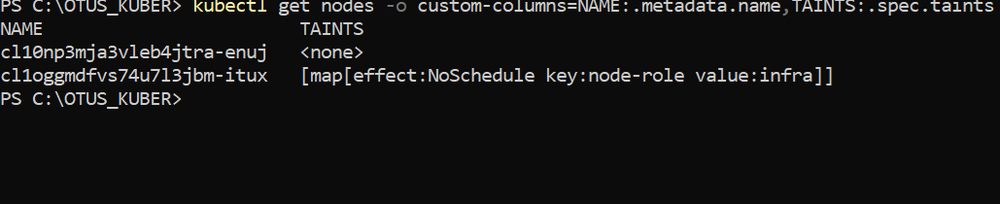
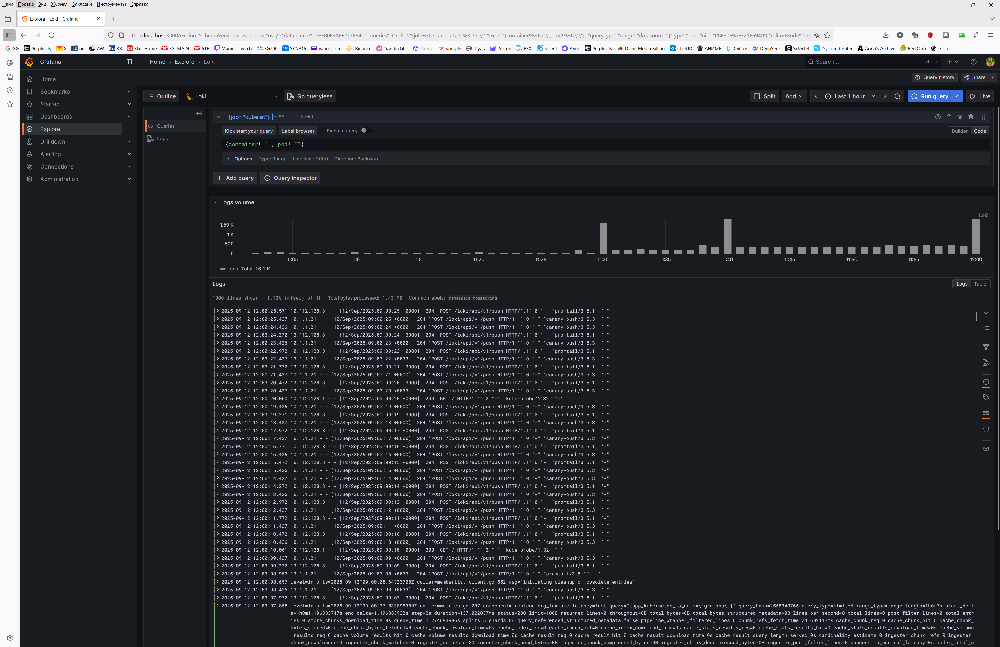
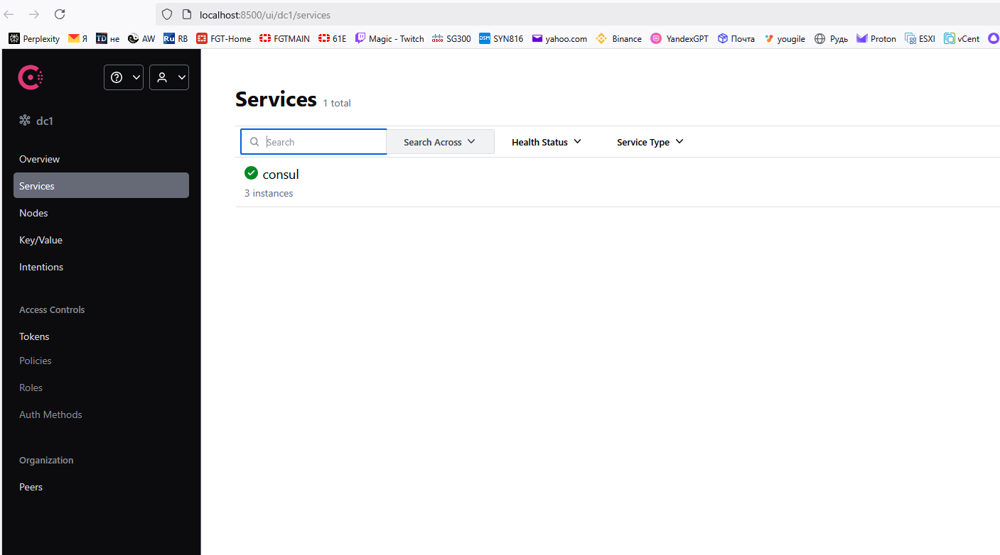
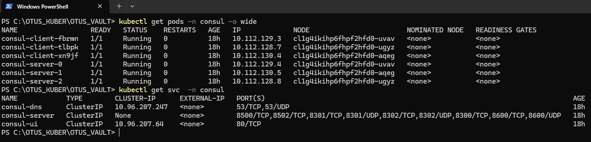
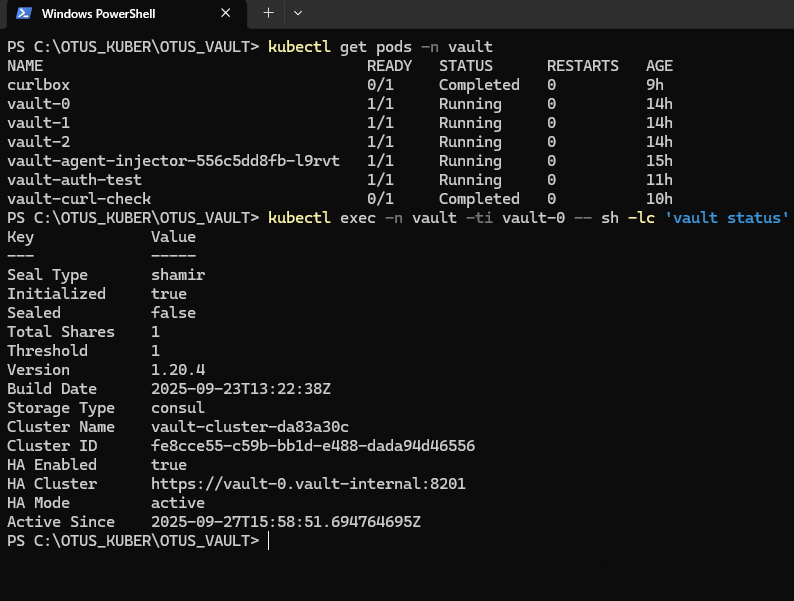
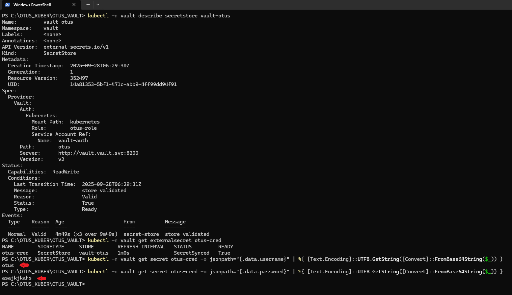
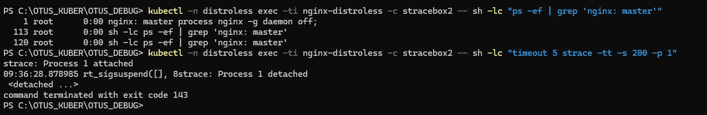

# Репозиторий для выполнения домашних заданий курса "Инфраструктурная платформа на основе Kubernetes-2025-06" 


1. HomeWork 1 

Необходимо создать манифест namespace.yaml для namespace с именем homework.  
Необходимо создать манифест pod.yaml. Он должен описывать под, который: 
* Будет создаваться в namespace homework
* Будет иметь контейнер, поднимающий веб-сервер на 8000 порту и отдающий содержимое папки /homework внутри этого контейнера.  
* Будет иметь init-контейнер, скачивающий или генерирующий файл index.html и сохраняющий его в директорию /init
* Будет иметь общий том (volume) для основного и init- контейнера, монтируемый в директорию /homework первого и /init второго 
* Будет удалять файл index.html из директории /homework основного контейнера, перед его завершением. 


<details>
  <summary>Ответ</summary>

Описание: 
 
namespace.yaml - создаёт namespace.  
configmap.yaml - заменяет дефолтный конфиг ngix.  
service.yaml - делаем сервис, для проверки работы пода снаружи через NodePort.  
pod.yaml - описываем сам под.  
emptyDir используется для передачи между init и nginx контейнерами пода index.html 

### Запуск
```
kubectl apply -f namespace.yaml
kubectl apply -f configmap.yaml
kubectl apply -f pod.yaml 
```
### Проверки
```
kubectl get ns homework 
kubectl get po -n homework 
kubectl get service -n homework 
kubectl exec homework-pod -n homework -- cat /homework/index.html

```


</details>

2. **HomeWork 2**

Необходимо создать манифест namespace.yaml для namespace с именем homework (уже создан в первом дз) 
Необходимо создать манифест deployment.yaml. Он должен описывать deployment, который будет создаваться в namespace homework 
Запускает 3 экземпляра пода, полностью аналогичных по спецификации прошлому ДЗ. 
В дополнение к этому будет иметь readiness пробу, проверяющую наличие файла /homework/index.html.

Будет иметь стратегию обновления RollingUpdate, настроенную так, что в процессе обновления может быть недоступен максимум 1 под. 
Добавить к манифесту deployment-а спецификацию, обеспечивающую запуск подов деплоймента, только на нодах кластера, имеющих метку homework=true. 

<details>
  <summary>Ответ</summary>

Создаём манифест 
```
apiVersion: apps/v1
kind: Deployment
metadata:
  name: homework-deployment
  namespace: homework
  labels:
    app: homework
spec:
  replicas: 3  # Запускаем 3 экземпляра пода из прошлого ДЗ
  selector:
    matchLabels:
      app: homework
  strategy:
    type: RollingUpdate
    rollingUpdate:
      maxUnavailable: 1  # В процессе обновления может быть недоступен 1 под
      maxSurge: 1        # Указываем что в процессе обновления можно создавать 1 дполнительный под
  template:
    metadata:
      labels:
        app: homework
    spec:
      nodeSelector:
        homework: "true"  # Указываем, что поды могут запускаться только на нодах с меткой homework
      volumes:
        - name: shared-volume
          emptyDir: {}
        - name: config-volume
          configMap:
            name: nginx-config
      initContainers:
        - name: init-container
          image: busybox
          command: ["/bin/sh", "-c"]
          args:
            - echo "<h1>OTUS HomeWORK 1</h1>" > /init/index.html;
          volumeMounts:
            - name: shared-volume
              mountPath: /init
      containers:
        - name: web-server
          image: nginx
          ports:
            - containerPort: 8000
          volumeMounts:
            - name: shared-volume
              mountPath: /homework
            - name: config-volume
              mountPath: /etc/nginx/nginx.conf
              subPath: nginx.conf
          readinessProbe:  # Проверяем наличие файла /homework/index.html
            exec:
              command: ["/bin/sh", "-c", "test -f /homework/index.html"]
            initialDelaySeconds: 5
            periodSeconds: 10
          lifecycle:
            preStop:
              exec:
                command: ["/bin/sh", "-c", "rm -f /homework/index.html"]

```
Ставим метку на ноду

```
kubectl label node node-1 homework=true
```

Проверяем, что на ноде есть метка
```
kubectl get nodes --show-labels | grep home
```

Проверяем, что поды запустились только на ноде, на которой есть метка(label)
```
kubectl get po -o wide -n homework 
```


Заметка про расширение Deployment

Should you manually scale a Deployment, example via kubectl scale deployment deployment --replicas=X, and then you update that Deployment based on a manifest (for example: by running kubectl apply -f deployment.yaml), 
 then applying that manifest overwrites the manual scaling that you previously did. 


</details>

3. **HomeWork 3**

Изменить readiness-пробу в манифесте deployment.yaml из прошлого ДЗ на httpGet, вызывающую URL /index.html. 
Необходимо создать манифест service.yaml, описывающий сервис типа ClusterIP, который будет направлять трафик на поды, управляемые вашим deployment.
 
Установить в кластер ingress-контроллер nginx.

Создать манифест ingress.yaml, в котором будет описан объект типа ingress, направляющий все http запросы к хосту homework.otus на ранее созданный сервис.

В результате запрос http://homework.otus/index.html должен отдавать код html страницы, находящейся в подах.

<details>
  <summary>Ответ</summary>

Устанавливаем  ingress-nginx и проверяем
```
kubectl apply -f https://raw.githubusercontent.com/kubernetes/ingress-nginx/controller-v1.9.4/deploy/static/provider/baremetal/deploy.yaml
kubectl get pods -n ingress-nginx
```

Создаём ingress

```
kind: Ingress #Создаём объект типа ingress, который управляет входящими http/https запросами и направляет их на сервисы.
metadata:
  name: homework-ingress
  namespace: homework
  annotations:
    nginx.ingress.kubernetes.io/rewrite-target: / #Данная аннотация означает, что если в запросе будет /index.html то ingress перепишет его на /
spec:
  ingressClassName: nginx
  rules:
  - host: homework.otus
    http:
      paths:
        - path: /
          pathType: Prefix
          backend:
            service:
              name: homework-service
              port:
                number: 80
```

Правим Service на Cluster ip

```
apiVersion: v1
kind: Service
metadata:
  name: homework-service
  namespace: homework
spec:
  selector:
    app: homework
  ports:
    - protocol: TCP
      port: 80
      targetPort: 8000
  type: ClusterIP
```

Правим тип проверки в deployment

```
          readinessProbe:
            httpGet: #проверка готовности будет выполняться http запросом
              path: /index.html # Страница которую мы запрашиваем для проверки
              port: 8000    # Порт на который выполняется http запрос, должен совпадать с containerPort:
            periodSeconds: 10 # Проверка запускается каждые 10 сек.
          lifecycle:
            preStop: #Хук который выполняется перед остановкой контейнера
              exec:
                command: ["/bin/sh", "-c", "rm -f /homework/index.html"]

```
Запускаем

```
kubectl apply -f .


```

Проверка по DNS внутри кластера:

```
root@master-1:/home/mity/OTUS/homework3# kubectl get svc -n homework
NAME               TYPE        CLUSTER-IP     EXTERNAL-IP   PORT(S)   AGE
homework-service   ClusterIP   10.233.14.50   <none>        80/TCP    13d
root@master-1:/home/mity/OTUS/homework3# curl http://homework-service.homework.svc.cluster.local/index.html
<h1>OTUS HomeWORK 3</h1>
```
```
root@master-1:/home/mity/OTUS/homework3# kubectl get ep -n homework
NAME               ENDPOINTS                                               AGE
homework-service   10.233.70.81:8000,10.233.70.82:8000,10.233.70.83:8000   13d
root@master-1:/home/mity/OTUS/homework3# 
```
Проверка через тестовый контейнер

```
root@master-1:/home/mity/OTUS/homework3# kubectl run -it --rm --image centosadmin/utils test bash -n homework
If you don't see a command prompt, try pressing enter.
bash-5.0# curl homework-service 
<h1>OTUS HomeWORK 3</h1>
```

</details>


4. **HomeWork 4**

Создать манифест pvc.yaml, описывающий PersistentVolumeClaim, запрашивающий хранилище с storageClass по-умолчанию

● Создать манифест cm.yaml для объекта типа configMap, описывающий произвольный набор пар ключ-значение

● В манифесте deployment.yaml изменить спецификацию volume типа emptyDir, который монтируется в init и основной контейнер, на pvc, созданный в предыдущем пункте

● В манифесте deployment.yaml добавить монтирование ранее созданного configMap как volume к основному контейнеру пода в директорию /homework/conf, так, чтобы его содержимое можно было получить, обратившись по url /conf/file


<details>
  <summary>Ответ</summary>


Создаём PV - используем локальную папку на ноде, т.к. у нас kubernetes, а не minikube/

```
ssh node-1
sudo mkdir -p /var/lib/k8s/pv/homework-1
sudo chown 65534:65534 /var/lib/k8s/pv/homework-1  
```

```
apiVersion: v1
kind: PersistentVolume
metadata:
  name: pv-homework-1
spec:
  capacity:
    storage: 1Gi
  accessModes:
    - ReadWriteOnce
  storageClassName: hw
  persistentVolumeReclaimPolicy: Retain
  hostPath:
    path: /var/lib/k8s/pv/homework-1
  nodeAffinity:
    required:
      nodeSelectorTerms:
      - matchExpressions:
        - key: kubernetes.io/hostname
          operator: In
          values:
          - node-1
```


Создаём манифест cm.yaml, с двумя парами ключ-значение.

```
# cm.yaml
apiVersion: v1
kind: ConfigMap
metadata:
  name: homework-config
  namespace: homework
data:
  file1.txt: |
    OPOP 111
  file2.txt: |
    OPOP 2222
```

Меняем в deployment volume вместо emptydir на pvc.

```
initContainers:
        - name: init-container
          image: busybox
          command: ["/bin/sh", "-c"]
          args:
            - echo "<h1>OTUS HomeWORK 3</h1>" > /init/index.html;
          volumeMounts:
            - name: homework-pvc
              mountPath: /init
      containers:
        - name: web-server
          image: nginx
          ports:
            - containerPort: 8000
          volumeMounts:
            - name: homework-pvc
              mountPath: /homework
            - name: config-volume
              mountPath: /etc/nginx/nginx.conf
              subPath: nginx.conf  # Монтируем только nginx.conf из configMap
            - name: homework-config
              mountPath: /homework/conf  # Монтируем файлы из cm.yaml в /homework/conf
          readinessProbe:

```


Проверка после применения всех манифестов:

```
root@master-1:/home/mity/OTUS/homework4# curl -H "Host: homework.otus" http://10.233.14.50/index.html
<h1>OTUS HomeWORK 3</h1>
root@master-1:/home/mity/OTUS/homework4# kubectl get svc -n homework 
NAME               TYPE        CLUSTER-IP     EXTERNAL-IP   PORT(S)   AGE
homework-service   ClusterIP   10.233.14.50   <none>        80/TCP    30d
root@master-1:/home/mity/OTUS/homework4# 

kubectl port-forward svc/homework-service 8000:80 -n homework

root@master-1:~# curl http://localhost:8000/conf/file1.txt
OPOP 111
root@master-1:~# curl http://localhost:8000/conf/file2.txt
OPOP 2222

```

Проверка через тестовый контейнер

```
 kubectl run -it --rm --image centosadmin/utils test bash -n homework
If you don't see a command prompt, try pressing enter.
bash-5.0# curl http://homework-service:80/conf/file1.txt
OPOP 111
bash-5.0# curl http://homework-service:80/conf/file2.txt
OPOP 2222
bash-5.0# 
```

</details>

5. **HomeWork 5**

В namespace homework создать service account monitoring и дать ему доступ к эндпоинту /metrics вашего кластера.
Изменить манифест deployment из прошлых ДЗ так, чтобы поды запускались под service account monitoring. 
В namespace homework создать service account с именем cd и дать ему роль admin в рамках namespace homework.
Создать kubeconfig для service account cd.
Сгенерировать для service account cd токен с временем действия 1 день и сохранить его в файл token/

<details>
  <summary>Ответ</summary>

В namespace homework создать service account monitoring и дать ему доступ к эндпоинту /metrics вашего кластера.
Изменить манифест deployment из прошлых ДЗ так, чтобы поды запускались под service account monitoring.   

Создаём манифест сервисного аккаунта
```
apiVersion: v1
kind: ServiceAccount
metadata:
  name: monitoring
  namespace: homework
secrets:
  - name: monitoring-service-account-token
```

Применяем:
```
kubectl apply -f service-account-monitoring.yaml
```


Создаём токен для аккаунта мониторинг
```
kubectl create token monitoring --duration=48h -n homework
```

Преобразуем в base64:

```
echo -n "$TOKEN" | base64
```

Создаём секрет для monitoring:

```
apiVersion: v1
kind: Secret
metadata:
  name: monitoring-service-account-token
  namespace: homework
  annotations:
    kubernetes.io/service-account.name: monitoring
type: kubernetes.io/service-account-token
data:
  token: |
    ZXlKaGJHY2lPaUpTVXpJMU5pSXNJbXRwWkNJNklrVmhXVlpoWDBWc1NrTmhaWFJpVm1OMVpUSndU
```

Применяем:
```
kubectl apply -f secret-service-account-monitoring.yaml
```

Изменяем манифест deployment.yaml чтобы под запускались из под аккаунта monitoring
```
spec:
      serviceAccountName: monitoring  # Подключаем сервисный аккаунт monitoring
      nodeSelector:
```
Применяем:
```
kubectl apply -f deployment.yaml
```

Создаём Кластерную роль monitoring c соответствующими правами:
```
apiVersion: rbac.authorization.k8s.io/v1
kind: ClusterRole
metadata:
  name: node-metrics-reader
rules:
- apiGroups: [""] 
  resources: ["nodes/metrics"] 
  verbs: ["get", "list"]
```

Применяем:
```
kubectl apply -f clusterrole-node-metrics.yaml
```

Связываем кластерную роль с сервисным аккаунтом monitoring:
```
apiVersion: rbac.authorization.k8s.io/v1
kind: ClusterRoleBinding
metadata:
  name: monitoring-node-metrics
subjects:
- kind: ServiceAccount
  name: monitoring
  namespace: homework
roleRef:
  kind: ClusterRole
  name: node-metrics-reader
  apiGroup: rbac.authorization.k8s.io
```

Применяем:
```
kubectl apply -f clusterrolebinding-node-metrics.yaml
```

Проверяем что метрики под данным аккаунтом можно получить и сервисы запущены под учеткой monitoring
```
curl -k \
  -H "Authorization: Bearer $TOKEN" \
  https://172.17.60.4:10250/metrics
```


Проверяем что сервисы запущены под учеткой monitoring

```
kubectl get pods -n homework -o jsonpath="{range .items[*]}{.metadata.name}{'\t'}{.spec.serviceAccountName}{'\n'}{end}"
```


В namespace homework создать service account с именем cd и дать ему роль admin в рамках namespace homework.
Создать kubeconfig для service account cd.
Сгенерировать для service account cd токен с временем действия 1 день и сохранить его в файл token/

Создаём сервисный аккаунт:

```
apiVersion: v1
kind: ServiceAccount
metadata:
  name: cd
  namespace: homework
```

Применяем:

```
kubectl apply -f service-account-cd.yaml
```

Связываем аккаунт cd c ролью

```
apiVersion: rbac.authorization.k8s.io/v1
kind: RoleBinding
metadata:
  name: cd-admin-binding
  namespace: homework
subjects:
  - kind: ServiceAccount
    name: cd
    namespace: homework
roleRef:
  kind: ClusterRole
  name: admin
  apiGroup: rbac.authorization.k8s.io
```

Применяем:

```
kubectl apply -f rolebinding-cd-admin.yaml
```

Создаём токен и сохраняем в файл:

```
kubectl create token cd --duration=24h -n homework > cd-token.txt
```

Получаем API сервера:
```
kubectl config view --minify -o jsonpath='{.clusters[0].cluster.server}'

```

Получаем рутовый сертификат:
```
kubectl get configmap kube-root-ca.crt -n homework -o jsonpath="{.data.ca\.crt}" > ca.crt
```

Присваиваем значения переменным и создаём cd-kubeconfig.yaml

Данный манифест позволяет командам (типо kubectl) аутентифицироваться в кластере как сервисный аккаунт cd и работать в namespace homework

```
export SERVER=https://127.0.0.1:6443
export TOKEN=$(cat cd-token.txt)

cat <<EOF > cd-kubeconfig.yaml
apiVersion: v1
kind: Config
clusters:
- cluster:
    certificate-authority: ca.crt
    server: ${SERVER}
  name: kubernetes
contexts:
- context:
    cluster: kubernetes
    namespace: homework
    user: cd
  name: cd-context
current-context: cd-context
users:
- name: cd
  user:
    token: ${TOKEN}
EOF
```

Проверяем 

```
KUBECONFIG=cd-kubeconfig.yaml kubectl get pods
```


</details>

8. **HomeWork 8**

Необходимо создать кастомный образ nginx, отдающий свои метрики на определенном endpoint 

● Установить в кластер Prometheus-operator любым удобным вам способом (рекомендуется ставить или по ссылке из офф документации, либо через helm-чарт) 

● Создать deployment запускающий ваш кастомный nginx образ и service для него 

● Настроить запуск nginx prometheus exporter (отдельным подом или в составе пода с nginx – не принципиально) и сконфигурировать его для сбора метрик с nginx 

● Создать манифест serviceMonitor, описывающий сбор метрик с подов, которые вы создали.


<details>
  <summary>Ответ</summary>


Устанавливаем оператор Prometheus через helm.


```
helm repo add prometheus-community https://prometheus-community.github.io/helm-charts
helm repo update

helm upgrade --install kube-prometheus-stack prometheus-community/kube-prometheus-stack \
  --namespace monitoring --create-namespace
```


Скачиваем/устанавливаем/проверяем последнюю версию nerdctl - cli для containerd
```
wget https://github.com/containerd/nerdctl/releases/download/v2.0.4/nerdctl-2.0.4-freebsd-amd64.tar.gz
tar -xzf nerdctl-2.0.4-freebsd-amd64.tar.gz
nerdctl --version
```


Скачиваем/устанавливаем buildkit - модный и более безопасный движок для сборки образов
```
curl -LO https://github.com/moby/buildkit/releases/download/v0.12.5/buildkit-v0.12.5.linux-amd64.tar.gz
tar -C /usr/local/bin -xzf buildkit-v0.12.5.linux-amd64.tar.gz
cp /tmp/buildkit/bin/* /usr/local/bin/
chmod +x /usr/local/bin/buildkitd /usr/local/bin/buildctl
which buildkitd


```

Запускаем/проверяем buildkit


```
# Создаем сервис

[Unit]
Description=BuildKit
Documentation=https://github.com/moby/buildkit

[Service]
ExecStart=/usr/local/bin/buildkitd --oci-worker=false --containerd-worker=true
Restart=always
RestartSec=5

[Install]
WantedBy=multi-user.target


# Запускаем 
sudo systemctl daemon-reload
sudo systemctl enable buildkit
sudo systemctl start buildkit

# Проверяем 
sudo systemctl status buildkit
```


nginx.conf - Добавляем endpoint для метрик - /stub_status

чтобы nginx предоставлял статистику в формате, который может читать прометей

Stub_status даёт:
* Active connections - активные соединени
* accepts - принятые соединения
* handled - обработанные соединения
* requests - общее количество запросов
* Reading/Writing/Waiting - статусы соединений


```
events {}

http {
    server {
        listen 80;
        location / {
            return 200 'OK';
            add_header Content-Type text/plain;
        }

        location /metrics {                   # отдаём stub_status нужный для экспорта метрик nginx-prometheus-exporter
            stub_status;
        }
    }
}
```


делаем простой докер с кастомным конфигом nginx

```
FROM nginx:stable

RUN apt update && apt install -y curl && rm -rf /var/lib/apt/lists/*

COPY nginx.conf /etc/nginx/nginx.conf

EXPOSE 80
```


собираем докер образ 
```
nerdctl build -t nginx-metrics:latest .
```


копируем образ на worker ноды
```
nerdctl save nginx-metrics:latest -o nginx-metrics.tar
scp nginx-metrics.tar node-1:/root/
scp nginx-metrics.tar node-2:/root/
```

Собираю deployment с кастомным образом nginx


nginx-metrics-deployment.yaml

```
apiVersion: apps/v1
kind: Deployment
metadata:
  name: nginx-metrics
  labels:
    app: nginx-metrics
spec:
  replicas: 1
  selector:
    matchLabels:
      app: nginx-metrics
  template:
    metadata:
      labels:
        app: nginx-metrics
    spec:
      containers:
        - name: nginx
          image: nginx-metrics:latest   # наш локальный кастомно собранный образ
          imagePullPolicy: IfNotPresent # не скачиваем образ, т.к. он уже залит на ноды
          ports:
            - containerPort: 80

```


Описываем service для nginx 

nginx-metrics-service.yaml

```
apiVersion: v1
kind: Service
metadata:
  name: nginx-metrics
spec:
  selector:
    app: nginx-metrics
  ports:
    - protocol: TCP
      port: 80
      targetPort: 80

```
Собираем Deployment для экспортера

nginx-exporter-deployment.yaml

```
apiVersion: apps/v1
kind: Deployment
metadata:
  name: nginx-exporter
spec:
  replicas: 1
  selector:
    matchLabels:
      app: nginx-exporter
  template:
    metadata:
      labels:
        app: nginx-exporter
    spec:
      containers:
        - name: exporter
          image: nginx/nginx-prometheus-exporter:latest
          args:
            - -nginx.scrape-uri=http://nginx-metrics:80/stub_status
          ports:
            - containerPort: 9113
```

Создаём Servicemonitor который используется  оператором Prometheus для автоматического обнаружения и сбора метрик

nginx-servicemonitor.yaml

```
apiVersion: monitoring.coreos.com/v1   # CRD который создал оператор Prometheus
kind: ServiceMonitor
metadata:
  name: nginx-exporter-monitor
  labels:
    release: kube-prometheus-stack
spec:
  selector:
    matchLabels:
      app: nginx-exporter
  namespaceSelector:
    matchNames:
      - default
  endpoints:
    - port: http
      interval: 15s
```

kube-prometheus-stack - это release name, Helm автоматически добавляет этот label во все связанные объекты

Проверяем что это так:
```
 kubectl get prometheus -n monitoring -o yaml | grep release
      meta.helm.sh/release-name: kube-prometheus-stack
      meta.helm.sh/release-namespace: monitoring
      release: kube-prometheus-stack
        release: kube-prometheus-stack
        release: kube-prometheus-stack
        release: kube-prometheus-stack
        release: kube-prometheus-stack
        release: kube-prometheus-stack
```


Запускаем services и daemonsetы
```
kubectl apply -f nginx-metrics-deployment.yaml
kubectl apply -f nginx-metrics-service.yaml
kubectl apply -f nginx-exporter-deployment.yaml
kubectl apply -f nginx-exporter-service.yaml
kubectl apply -f nginx-servicemonitor.yaml
```


включаем форвардинг
```
kubectl port-forward svc/nginx-exporter 9113:9113
```


Проверяем, что метрики приходят:

```
root@master-2:~# curl http://localhost:9113/metrics
# HELP go_gc_duration_seconds A summary of the wall-time pause (stop-the-world) duration in garbage collection cycles.
# TYPE go_gc_duration_seconds summary
go_gc_duration_seconds{quantile="0"} 0
go_gc_duration_seconds{quantile="0.25"} 0
go_gc_duration_seconds{quantile="0.5"} 0
go_gc_duration_seconds{quantile="0.75"} 0
go_gc_duration_seconds{quantile="1"} 0
go_gc_duration_seconds_sum 0
go_gc_duration_seconds_count 0
# HELP go_gc_gogc_percent Heap size target percentage configured by the user, otherwise 100. This value is set by the GOGC environment variable, and the runtime/debug.SetGCPercent function. Sourced from /gc/gogc:percent
# TYPE go_gc_gogc_percent gauge
go_gc_gogc_percent 100
# HELP go_gc_gomemlimit_bytes Go runtime memory limit configured by the user, otherwise math.MaxInt64. This value is set by the GOMEMLIMIT environment variable, and the runtime/debug.SetMemoryLimit function. Sourced from /gc/gomemlimit:bytes
# TYPE go_gc_gomemlimit_bytes gauge
go_gc_gomemlimit_bytes 9.223372036854776e+18
# HELP go_goroutines Number of goroutines that currently exist.
# TYPE go_goroutines gauge
go_goroutines 11
# HELP go_info Information about the Go environment.
# TYPE go_info gauge
go_info{version="go1.23.4"} 1
```
</details>


9. **Homework 9**

**Сервисы централизованного логирования для компонентов Kubernetes и приложений**

Разверните managed Kubernetes cluster в Yandex cloud любым удобным вам способом 

● Для кластера создайте 2 пула нод: 

● Для рабочей нагрузки (можно 1 ноду) 

● Для инфраструктурных сервисов (также хватит пока и 1 ноды) 

● Для инфраструктурной ноды/нод добавьте taint, запрещающий на нее планирование подов с посторонней нагрузкой -  

node-role=infra:NoSchedule 

● Приложите к ДЗ вывод комманд kubectl get node -o wide  

--show-labels и kubectl get nodes -o custom-columns=NAME:.metadata.name,TAINTS:.spec.taints  

показывающий конфигурацию нод в вашем кластере 

● Создайте бакет в s3 object storage Yandex cloud. В нем будут храниться логи, собираемые loki. Также необходимо будет создать ServiceAccount для доступа к бакету и сгенерировать ключи доступа согласно инструкции YC 

● Установите в кластер Loki  

● монолитный или распределенный режим не принципиально 

● Необходимо сконфигурировать параметры установки так, чтобы компоненты loki устанавливались исключительно на infra-ноды (добавить соответствующий toleration для обхода taint, а также nodeSelector или nodeAffinity на ваш выбор, для планирования подов только на заданные ноды) 

● Место хранения логов – s3 бакет, ранее сконфигурированный вами 

● Auth_enabled: false 


Установите в кластер promtail

● Агенты promtail должны быть развернуты на всех нодах кластера, включая infra-ноды (добавить toleration) 

● Установите в кластер Grafana

● Должна быть установлена на infra-ноды (toleration и nodeSelector/NodeAffinity)

● Для установленных loki, promtail и Grafana приложить к ДЗ файлы values.yaml, которые вы использовали для установки, а также команду установки и репозиторий, из которого ставили, если требуется. Не обязательно устанавливать все 3 компонента из разных чартов, приложите именно тот способ установки, который вы использовали.

● В Grafana необходимо настроить data source к loki и сделать explore по этому datasource и убедиться, что логи отображаются. 

Приложить скриншот этого экрана из Grafana


<details>
  <summary>Ответ</summary>

Подготовка кластера в YC.

Создаём кластер через GUI.

Подключаемся к кластеру
```
yc managed-kubernetes cluster get-credentials --id catu0bn14so432joeegj --external --force
```

Создаём 2 пула нод

```
yc managed-kubernetes node-group create `
  --name infra-pool `
  --cluster-id catu0bn14so432joeegj `
  --platform standard-v3 `
  --cores 2 `
  --memory 4 `
  --disk-size 50 `
  --fixed-size 1 `
  --location zone=ru-central1-b `
  --network-interface subnet-id=e2lm05cccru4pu6035u7 `
  --node-labels node-role=infra
```

```
yc managed-kubernetes node-group create `
  --name workload-pool `
  --cluster-id catu0bn14so432joeegj `
  --platform standard-v3 `
  --cores 2 `
  --memory 4 `
  --disk-size 50 `
  --fixed-size 1 `
  --subnet-ids e2lm05cccru4pu6035u7 `
  --location zone=ru-central1-b
```

Ставим tain на infra

```
kubectl taint nodes -l node-role=infra node-role=infra:NoSchedule --overwrite
```
Проверяем:

```
kubectl get nodes -o wide --show-labels
kubectl get nodes -o custom-columns=NAME:.metadata.name,TAINTS:.spec.taints` 
```



Настраиваем NAT и настраиваем маршрутизацию

```
yc vpc gateway create nat-gw-otus
$gwid = (yc vpc gateway list --format json | ConvertFrom-Json | Where-Object {$_.name -eq "nat-gw-otus"} | Select-Object -First 1).id
yc vpc route-table create rt-nat-otus --network-id enpqkelt40cfrtd6vj16
yc vpc route-table update rt-nat-otus --append-route destination=0.0.0.0/0,gateway-id=$gwid
yc vpc subnet update e2lm05cccru4pu6035u7 --route-table-id rt-nat-otus
```

Создаём Service account для loki

```
yc iam service-account create --name loki-sa
```

Назначаем права storage.editor

```
yc resource-manager folder add-access-binding b1gk8kui30tcpritnj9b `
  --role storage.editor `
  --service-account-name loki-sa
```

Создаём и сохраняем ключи
```
yc iam access-key create --service-account-name loki-sa
```

Подключаем репу Helm

```
helm repo add grafana https://grafana.github.io/helm-charts
helm repo update
```

Создаём и устанавливаем values-loki.yaml, values-promtail.yaml, values-grafana.yaml

```
helm upgrade --install loki grafana/loki -n monitoring --create-namespace -f .\values-loki.yaml --set canary.enabled=false
helm upgrade --install promtail grafana/promtail -n monitoring -f .\values-promtail.yaml
helm upgrade --install grafana grafana/grafana -n monitoring -f .\values-grafana.yaml
```
Пробрасываем порт
```
kubectl port-forward -n monitoring svc/grafana 3000:80
```

Логинимся и выполняем запрос через graphana

```
{container!="", pod!=""}
```




</details>

11. **HomeWork 11**

Разверните managed Kubernetes cluster в Yandex cloud любым удобным вам способом. Создайте 3 ноды для кластера

● В namespace consul установите consul из helm-чарта https://github.com/hashicorp/consul-k8s.git с параметрами 3 реплики для сервера. Приложите команду установки чарта и файл с переменными к результатам ДЗ.

● В namespace vault установите hashicorp vault из helm-чарта https://github.com/hashicorp/vault-helm.git

● Сконфигурируйте установку для использования ранее установленного consul в HA режиме

● Приложите команду установки чарта и файл с переменными к результатам ДЗ.

● Выполните инициализацию vault и распечатайте с помощью полученного unseal key все поды хранилища

● Создайте хранилище секретов otus/ с Secret Engine KV, а в нем 

секрет otus/cred, содержащий username='otus' password='asajkjkahs’

● В namespace vault создайте serviceAccount с именем vault-auth и ClusterRoleBinding для него с ролью system:auth-delegator. 
Приложите получившиеся манифесты к результатам ДЗ

● В Vault включите авторизацию auth/kubernetes и сконфигурируйте ее используя токен и сертификат ранее созданного ServiceAccount

● Создайте и примените политику otus-policy для секретов /otus/cred с capabilities = [“read”, “list”]. Файл .hcl с политикой приложите к результатам ДЗ


Создайте роль auth/kubernetes/role/otus в vault с использованием ServiceAccount vault-auth из namespace Vault и политикой otus-policy

● Установите External Secrets Operator из helm-чарта в namespace vault. Команду установки чарта и файл с переменными, если вы их используете приложите к результатам ДЗ

● Создайте и примените манифест crd объекта SecretStore в namespace vault, сконфигурированный для доступа к KV секретам Vault с использованием ранее созданной роли otus и сервис аккаунта vault-auth. Убедитесь, что созданный SecretStore успешно подключился к vault. Получившийся манифест приложите к результатам ДЗ.

Создайте и примените манифест crd объекта ExternalSecret с следующими параметрами:

● ns – vault

● SecretStore – созданный на прошлом шаге

● Target.name = otus-cred

● Получает значения KV секрета /otus/cred из vault и отображает их в два ключа – username и password соответственно

● Убедитесь, что после применения ExternalSecret будет создан Secret в ns vault с именем otus-cred и хранящий в себе 2 ключа username и password, со значениями, которые были сохранены ранее в vault. Добавьте манифест объекта ExternalSecret к результатам ДЗ.


<details>
  <summary>Ответ</summary>

Создаём 3 нода к

```
yc managed-kubernetes node-group create `
  --name $NODEGROUP `
  --cluster-id $CLUSTER_ID `
  --platform standard-v3 `
  --cores 2 `
  --memory 4 `
  --disk-size 50 `
  --fixed-size 3 `
  --location zone=$ZONE `
  --network-interface "subnets=$SUBNET_ID,ipv4-address=nat" `
  --node-labels node-role=worker
```
Устанавливаем helm на W11 и проверяем

```
choco install kubernetes-helm -y
helm version
```

Установка, настройка проверка Consul 

```
kubectl create namespace consul
```

values-consul.yaml

```
global:
  name: consul
  datacenter: dc1

server:
  replicas: 3                
  bootstrapExpect: 3         # ожидаем 3 сервера для кворума
  storage: 10Gi              
  disruptionBudget:
    enabled: true

ui:
  enabled: true              # включим веб

client:
  enabled: true             

connectInject:
  enabled: false           

resources:
  requests:
    cpu: 100m
    memory: 256Mi
  limits:
    cpu: 500m
    memory: 512Mi

```

Установка

```
helm upgrade --install consul hashicorp/consul `
  -n consul `
  -f .\values-consul.yaml
```

Проверка

```
kubectl get pods -n consul -o wide
kubectl get svc  -n consul
kubectl port-forward -n consul svc/consul-ui 8500:80
```





Установка и подготовка Vault

values-vault.yaml

```
server:
  replicas: 3
  ha:
    enabled: true
    config: |
      ui = true

      listener "tcp" {
        address     = "0.0.0.0:8200"
        tls_disable = 1
      }

      storage "consul" {
        address = "consul-server.consul.svc.cluster.local:8500"
        path    = "vault/"
      }

      disable_mlock = true

  dataStorage:
    enabled: true
    size: 5Gi
    storageClass: yc-network-hdd

  disruptionBudget:
    enabled: true
    maxUnavailable: 1

  service:
    type: ClusterIP

ui:
  enabled: true
  serviceType: ClusterIP

```

```
kubectl create ns vault

helm upgrade --install vault hashicorp/vault `
  -n vault `
  -f .\values-vault.yaml
```

Получаем данные для распечатывания(unseal)

```
PS C:\OTUS_KUBER\OTUS_VAULT> kubectl exec -n vault -ti vault-0 -- sh -lc "vault operator init -key-shares=1 -key-threshold=1" `
>> | Tee-Object -FilePath .\init.txt

Unseal Key 1: NACzVjx5IwpK4Mqkn0FWK1MAQlztpQ4Y+NSdieDTEiQ=

Initial Root Token: hvs.hMVSwUJliksqwZFNIK7h549p

Vault initialized with 1 key shares and a key threshold of 1. Please securely
distribute the key shares printed above. When the Vault is re-sealed,
restarted, or stopped, you must supply at least 1 of these keys to unseal it
before it can start servicing requests.

Vault does not store the generated root key. Without at least 1 keys to
reconstruct the root key, Vault will remain permanently sealed!

It is possible to generate new unseal keys, provided you have a quorum of
existing unseal keys shares. See "vault operator rekey" for more information.
PS C:\OTUS_KUBER\OTUS_VAULT>
```

Инициализация и распечатывание

```
kubectl exec -n vault -ti vault-0 -- sh -lc "vault operator init -key-shares=1 -key-threshold=1" `
| Tee-Object -FilePath .\init.txt

$UNSEAL_KEY = (Get-Content .\init.txt | Select-String "Unseal Key" | Select-Object -First 1).ToString().Split(":")[1].Trim()
$ROOT_TOKEN = (Get-Content .\init.txt | Select-String "Initial Root Token" | Select-Object -First 1).ToString().Split(":")[1].Trim()

# unseal для всех еплик
kubectl exec -n vault -ti vault-0 -- sh -lc "vault operator unseal '$UNSEAL_KEY'"
kubectl exec -n vault -ti vault-1 -- sh -lc "vault operator unseal '$UNSEAL_KEY'"
kubectl exec -n vault -ti vault-2 -- sh -lc "vault operator unseal '$UNSEAL_KEY'"

```
# проверка
kubectl get pods -n vault
kubectl exec -n vault -ti vault-0 -- sh -lc 'vault status'




Включаем KV  и создаём секрет через vault-0

```
vault secrets enable -path=otus kv-v2 || true
vault kv put otus/cred username=otus password=asajkjkahs
vault kv get otus/cred

```

ServiceAccount и RBAC для Kubernetes-auth

vault-auth-rbac.yaml
```
apiVersion: v1
kind: ServiceAccount
metadata:
  name: vault-auth
  namespace: vault
---
apiVersion: rbac.authorization.k8s.io/v1
kind: ClusterRoleBinding
metadata:
  name: vault-auth-delegator
roleRef:
  apiGroup: rbac.authorization.k8s.io
  kind: ClusterRole
  name: system:auth-delegator
subjects:
  - kind: ServiceAccount
    name: vault-auth
    namespace: vault
```

```
kubectl apply -f .\vault-auth-rbac.yam
```

В Vault включите авторизацию auth/kubernetes и сконфигурируйте ее используя токен и сертификат ранее созданного ServiceAccount

В vault-0

```
vault auth enable kubernetes || true

cp /var/run/secrets/kubernetes.io/serviceaccount/token  /tmp/sa.token
cp /var/run/secrets/kubernetes.io/serviceaccount/ca.crt /tmp/ca.crt

vault write auth/kubernetes/config \
  token_reviewer_jwt=@/tmp/sa.token \
  kubernetes_host=https://kubernetes.default.svc \
  kubernetes_ca_cert=@/tmp/ca.crt \
  issuer=kubernetes.default.svc

vault read auth/kubernetes/config
```

Создайте и примените политику otus-policy для секретов /otus/cred с capabilities = [“read”, “list”]

otus-policy.hcl
```
path "otus/data/*" {
  capabilities = ["read","list"]
}
path "otus/metadata/*" {
  capabilities = ["read","list"]
}
```

Создайте и примените манифест crd объекта ExternalSecret с следующими параметрами:
● ns – vault
● SecretStore – созданный на прошлом шаге
● Target.name = otus-cred
● Получает значения KV секрета /otus/cred из vault и отображает их в два ключа – username и password соответственно

externalsecret.yaml
```
apiVersion: external-secrets.io/v1
kind: ExternalSecret
metadata:
  name: otus-cred
  namespace: vault
spec:
  refreshInterval: 1m
  secretStoreRef:
    name: vault-otus
    kind: SecretStore
  target:
    name: otus-cred
    creationPolicy: Owner
  data:
    - secretKey: username
      remoteRef:
        key: cred
        property: username
    - secretKey: password
      remoteRef:
        key: cred
        property: password
```

secretstore.yaml

```
apiVersion: external-secrets.io/v1
kind: SecretStore
metadata:
  name: vault-otus
  namespace: vault
spec:
  provider:
    vault:
      server: http://vault.vault.svc:8200
      path: otus
      version: v2
      auth:
        kubernetes:
          mountPath: kubernetes
          role: otus-role
          serviceAccountRef:
            name: vault-auth

```

Проверка:
```
kubectl -n vault describe secretstore vault-otus
kubectl -n vault get externalsecret otus-cred
kubectl -n vault get secret otus-cred -o jsonpath="{.data.username}" | %{ [Text.Encoding]::UTF8.GetString([Convert]::FromBase64String($_)) }
kubectl -n vault get secret otus-cred -o jsonpath="{.data.password}" | %{ [Text.Encoding]::UTF8.GetString([Convert]::FromBase64String($_)) }
```




Описание файлов из репозитория:


curlbox.yaml —  Ручные провероки логина в Vault

vault-auth-curl.yaml — тестовыйй под с curl, запущенный от vault-auth

vault-auth-test.yaml — тестовый под для логина в Vault через Kubernetes auth и попытки чтения otus/cred.


</details>


13. **Homework 13**
Создайте манифест, описывающий pod с distroless образом для создания контейнера, например kyos0109/nginx-distroless и примените его в кластере. Приложите манифест к результатам ДЗ.

● С помощью команды kubectl debug создайте эфемерный контейнер для отладки этого пода. Отладочный контейнер должен иметь доступ к пространству имен pid для основного контейнера пода.

● Получите доступ к файловой системе отлаживаемого контейнера из эфемерного. Приложите к результатам ДЗ вывод команды ls –la для директории /etc/nginx

● Запустите в отладочном контейнере команду tcpdump -nn -i any -e port 80 (или другой порт, если у вас приложение на нем)

● Выполните несколько сетевых обращений к nginx в отлаживаемом поде любым удобным вам способом. Убедитесь что tcpdump отображает сетевые пакеты этих подключений. Приложите результат работы tcpdump к результатам ДЗ.

● С помощью kubectl debug создайте отладочный под для ноды, на которой запущен ваш под с distroless nginx

● Получите доступ к файловой системе ноды, и затем доступ к логам пода с distrolles nginx. Приложите сами логи, и команду их получения к результатам ДЗ. 


<details>
  <summary>Ответ</summary>

Создаём требуемый под 

nginx-configmap.yaml
```
apiVersion: v1
kind: ConfigMap
metadata:
  name: nginx-conf
  namespace: distroless
data:
  nginx.conf: |
    worker_processes  auto;

    events {
      worker_connections  1024;
    }

    http {
      log_format main '$remote_addr - $remote_user [$time_local] "$request" '
                      '$status $body_bytes_sent "$http_referer" '
                      '"$http_user_agent" "$http_x_forwarded_for"';

      access_log  /dev/stdout main;
      error_log   /dev/stderr warn;

      sendfile on;

      server {
        listen 80;
        server_name _;

        location / {
          return 200 'ok\n';
        }
      }
    }
```

ns-distroless.yaml
```
apiVersion: v1
kind: Namespace
metadata:
  name: distroless
```

nginx-distroless-pod.yaml
```
apiVersion: v1
kind: Pod
metadata:
  name: nginx-distroless
  namespace: distroless
  labels:
    app: nginx-distroless
spec:
  containers:
  - name: nginx
    image: kyos0109/nginx-distroless:latest
    ports:
    - containerPort: 80
      name: http
    volumeMounts:
    - name: nginx-conf
      mountPath: /etc/nginx/nginx.conf
      subPath: nginx.conf
      readOnly: true
  volumes:
  - name: nginx-conf
    configMap:
      name: nginx-conf
```

Применяем и проверяем:

```
kubectl apply -f .\ns-distroless.yaml
kubectl apply -f .\nginx-configmap.yaml
kubectl apply -f .\nginx-distroless-pod.yaml
kubectl -n distroless get pod -o wide
```

запускаем эфемерный контейнер:

```
 kubectl -n distroless debug pod/nginx-distroless `
  --image=nicolaka/netshoot `
  --target=nginx `
  -it -- bas
```

Проверяем:
```
nginx-distroless:~# ls -la /proc/1/root/etc/nginx
total 48
drwxr-xr-x    3 root     root          4096 Oct  5  2020 .
drwxr-xr-x    1 root     root          4096 Oct  5 06:45 ..
drwxr-xr-x    2 root     root          4096 Oct  5  2020 conf.d
-rw-r--r--    1 root     root          1007 Apr 21  2020 fastcgi_params
-rw-r--r--    1 root     root          2837 Apr 21  2020 koi-utf
-rw-r--r--    1 root     root          2223 Apr 21  2020 koi-win
-rw-r--r--    1 root     root          5231 Apr 21  2020 mime.types
lrwxrwxrwx    1 root     root            22 Apr 21  2020 modules -> /usr/lib/nginx/modules
-rw-r--r--    1 root     root           586 Oct  5 06:45 nginx.conf
-rw-r--r--    1 root     root           636 Apr 21  2020 scgi_params
-rw-r--r--    1 root     root           664 Apr 21  2020 uwsgi_params
-rw-r--r--    1 root     root          3610 Apr 21  2020 win-utf


nginx-distroless:~# sed -n '1,120p' /proc/1/root/etc/nginx/nginx.conf
worker_processes  auto;

events {
  worker_connections  1024;
}

http {
  log_format main '$remote_addr - $remote_user [$time_local] "$request" '
                  '$status $body_bytes_sent "$http_referer" '
                  '"$http_user_agent" "$http_x_forwarded_for"';

  access_log  /dev/stdout main;
  error_log   /dev/stderr warn;

  sendfile on;

  server {
    listen 80;
    server_name _;

    location / {
      return 200 'ok\n';
    }
  }
}

```

В одном окне запускаем tcpdump, во втором curlbox для проверки, что пакеты приходят

```
tcpdump -nn -i any -e port 80
```

```
$ip = kubectl -n distroless get pod nginx-distroless -o jsonpath='{.status.podIP}'

kubectl -n distroless run curlbox --rm -it --restart=Never --image=curlimages/curl:8.9.1 -- `
  sh -lc "for i in 1 2 3 4 5; do curl -sS http://$ip/; sleep 1; done"
```


Создаём отладочный под для ноды, использовал манифест, т.к. возникли проблемы с пулом образов...

Получаем UID nginx пода и ноды
```
PS C:\OTUS_KUBER\OTUS_DEBUG> $PUID = kubectl -n distroless get pod nginx-distroless -o jsonpath='{.metadata.uid}'
PS C:\OTUS_KUBER\OTUS_DEBUG> $NODE = kubectl -n distroless get pod nginx-distroless -o jsonpath='{.spec.nodeName}'
PS C:\OTUS_KUBER\OTUS_DEBUG> $PUID
88b86404-47e7-4441-b68b-1c29fa20d91a
PS C:\OTUS_KUBER\OTUS_DEBUG> $NODE
cl1g4ikihp6fhpf2hfd0-uvav
```

node-debug.yaml
```
apiVersion: v1
kind: Pod
metadata:
  name: node-debug
  namespace: distroless
  labels:
    run: node-debugger
spec:
  nodeName: cl1g4ikihp6fhpf2hfd0-uvav
  hostPID: true
  restartPolicy: Never
  containers:
  - name: debugger
    image: registry.k8s.io/e2e-test-images/busybox:1.29
    command: ["/bin/sh","-lc"]
    args: ["sleep 3600"]
    securityContext:
      privileged: true
    volumeMounts:
    - name: host-root
      mountPath: /host
      readOnly: true
  volumes:
  - name: host-root
    hostPath:
      path: /
      type: Directory
```

Смотрим какие файлы соотвествуют нашему контейнеру:

```
PS C:\OTUS_KUBER\OTUS_DEBUG> kubectl -n distroless exec -ti node-debug -- sh -lc "ls -l /host/var/log/containers | grep nginx-distroless || true"
lrwxrwxrwx    1 root     root            99 Oct  5 06:49 nginx-distroless_distroless_debugger-v5j95-580a7291a289decae9e969b0f786cc26b989cec783c2206be663c9288eb5b659.log -> /var/log/pods/distroless_nginx-distroless_88b86404-47e7-4441-b68b-1c29fa20d91a/debugger-v5j95/0.log
lrwxrwxrwx    1 root     root            90 Oct  5 06:45 nginx-distroless_distroless_nginx-90065161de7402f24c395bc79fcdc3184d969116e9ea9b7cdddeb33b37c45084.log -> /var/log/pods/distroless_nginx-distroless_88b86404-47e7-4441-b68b-1c29fa20d91a/nginx/0.log
```

Выкачиваем лог:

```
kubectl -n distroless cp `
  node-debug:/host/var/log/pods/distroless_nginx-distroless_$($PUID)/nginx/0.log `
  .\nginx-distroless-0.log
```

Задача со *

Выполните команду strace для корневого процесса nginx в рассматриваемом ранее поде.

Опишите в результатах ДЗ какие операции необходимо сделать, для успешного выполнения команды, и также приложите ее вывод к результатам ДЗ.

distroless-образ не содержит strace и других утилит, поэтому нужно создать эфемернвый контейнер, в котором есть strace.
Запустить это контейнер в том же поде и поделиться PID-неймспейсом с основным контейнером для просмотра процессов.

Создание эфемерного контейнера:

```
$NS  = "distroless"
$POD = "nginx-distroless"

kubectl -n $NS debug pod/$POD `
  --target=nginx `
  --image=nicolaka/netshoot:latest `
  --share-processes `
  --container=stracebox2 `
  --profile=general `
  --attach=false `
  -- bash -lc "sleep infinity"

```
debug pod - создаём контейнер в существующем поде
--target=nginx - указываем с кем делить cgroup/namespace
--share-processes - разрешаем видеть процессы основного контейнера
--profile=general - без него ptrace не работает


Команда strace для корневого процесса

```
kubectl -n distroless exec -ti nginx-distroless -c stracebox2 -- sh -lc "timeout 5 strace -tt -s 200 -p 1"
```




</details>

