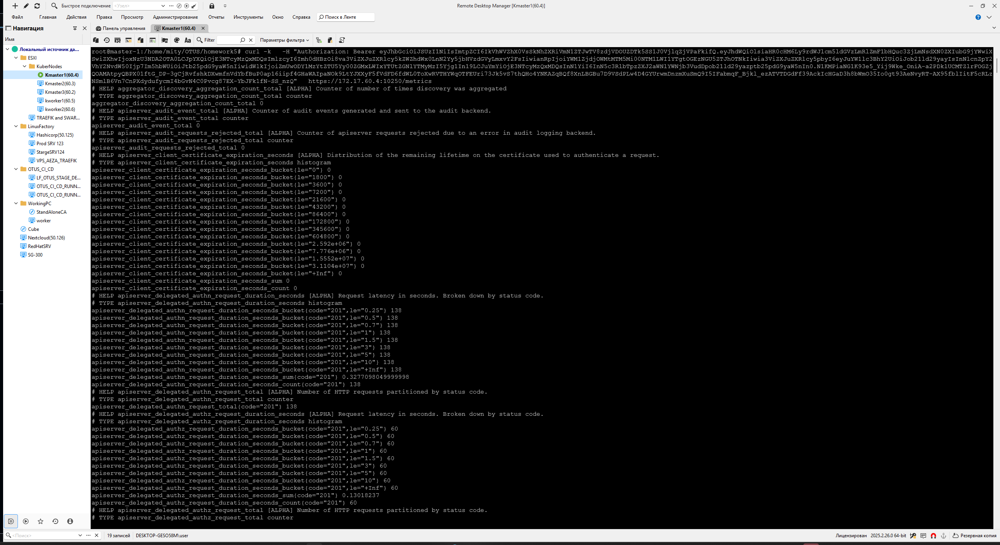
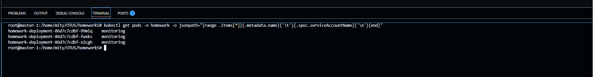
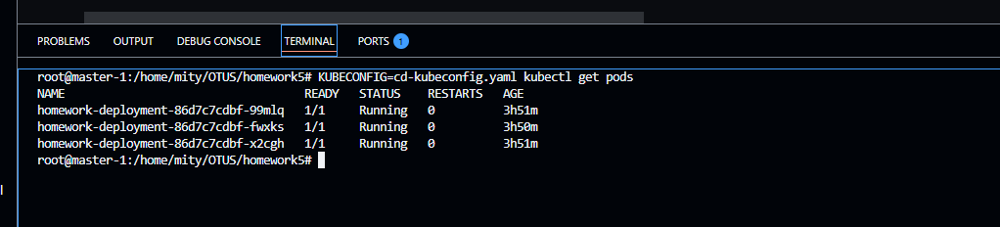

# Репозиторий для выполнения домашних заданий курса "Инфраструктурная платформа на основе Kubernetes-2025-06" 


1. HomeWork 1 

Необходимо создать манифест namespace.yaml для namespace с именем homework.  
Необходимо создать манифест pod.yaml. Он должен описывать под, который: 
* Будет создаваться в namespace homework
* Будет иметь контейнер, поднимающий веб-сервер на 8000 порту и отдающий содержимое папки /homework внутри этого контейнера.  
* Будет иметь init-контейнер, скачивающий или генерирующий файл index.html и сохраняющий его в директорию /init
* Будет иметь общий том (volume) для основного и init- контейнера, монтируемый в директорию /homework первого и /init второго 
* Будет удалять файл index.html из директории /homework основного контейнера, перед его завершением. 


<details>
  <summary>Ответ</summary>

Описание: 
 
namespace.yaml - создаёт namespace.  
configmap.yaml - заменяет дефолтный конфиг ngix.  
service.yaml - делаем сервис, для проверки работы пода снаружи через NodePort.  
pod.yaml - описываем сам под.  
emptyDir используется для передачи между init и nginx контейнерами пода index.html 

### Запуск
```
kubectl apply -f namespace.yaml
kubectl apply -f configmap.yaml
kubectl apply -f pod.yaml 
```
### Проверки
```
kubectl get ns homework 
kubectl get po -n homework 
kubectl get service -n homework 
kubectl exec homework-pod -n homework -- cat /homework/index.html

```


</details>

2. **HomeWork 2**

Необходимо создать манифест namespace.yaml для namespace с именем homework (уже создан в первом дз) 
Необходимо создать манифест deployment.yaml. Он должен описывать deployment, который будет создаваться в namespace homework 
Запускает 3 экземпляра пода, полностью аналогичных по спецификации прошлому ДЗ. 
В дополнение к этому будет иметь readiness пробу, проверяющую наличие файла /homework/index.html.

Будет иметь стратегию обновления RollingUpdate, настроенную так, что в процессе обновления может быть недоступен максимум 1 под. 
Добавить к манифесту deployment-а спецификацию, обеспечивающую запуск подов деплоймента, только на нодах кластера, имеющих метку homework=true. 

<details>
  <summary>Ответ</summary>

Создаём манифест 
```
apiVersion: apps/v1
kind: Deployment
metadata:
  name: homework-deployment
  namespace: homework
  labels:
    app: homework
spec:
  replicas: 3  # Запускаем 3 экземпляра пода из прошлого ДЗ
  selector:
    matchLabels:
      app: homework
  strategy:
    type: RollingUpdate
    rollingUpdate:
      maxUnavailable: 1  # В процессе обновления может быть недоступен 1 под
      maxSurge: 1        # Указываем что в процессе обновления можно создавать 1 дполнительный под
  template:
    metadata:
      labels:
        app: homework
    spec:
      nodeSelector:
        homework: "true"  # Указываем, что поды могут запускаться только на нодах с меткой homework
      volumes:
        - name: shared-volume
          emptyDir: {}
        - name: config-volume
          configMap:
            name: nginx-config
      initContainers:
        - name: init-container
          image: busybox
          command: ["/bin/sh", "-c"]
          args:
            - echo "<h1>OTUS HomeWORK 1</h1>" > /init/index.html;
          volumeMounts:
            - name: shared-volume
              mountPath: /init
      containers:
        - name: web-server
          image: nginx
          ports:
            - containerPort: 8000
          volumeMounts:
            - name: shared-volume
              mountPath: /homework
            - name: config-volume
              mountPath: /etc/nginx/nginx.conf
              subPath: nginx.conf
          readinessProbe:  # Проверяем наличие файла /homework/index.html
            exec:
              command: ["/bin/sh", "-c", "test -f /homework/index.html"]
            initialDelaySeconds: 5
            periodSeconds: 10
          lifecycle:
            preStop:
              exec:
                command: ["/bin/sh", "-c", "rm -f /homework/index.html"]

```
Ставим метку на ноду

```
kubectl label node node-1 homework=true
```

Проверяем, что на ноде есть метка
```
kubectl get nodes --show-labels | grep home
```

Проверяем, что поды запустились только на ноде, на которой есть метка(label)
```
kubectl get po -o wide -n homework 
```


Заметка про расширение Deployment

Should you manually scale a Deployment, example via kubectl scale deployment deployment --replicas=X, and then you update that Deployment based on a manifest (for example: by running kubectl apply -f deployment.yaml), 
 then applying that manifest overwrites the manual scaling that you previously did. 


</details>

3. **HomeWork 3**

Изменить readiness-пробу в манифесте deployment.yaml из прошлого ДЗ на httpGet, вызывающую URL /index.html. 
Необходимо создать манифест service.yaml, описывающий сервис типа ClusterIP, который будет направлять трафик на поды, управляемые вашим deployment.
 
Установить в кластер ingress-контроллер nginx.

Создать манифест ingress.yaml, в котором будет описан объект типа ingress, направляющий все http запросы к хосту homework.otus на ранее созданный сервис.

В результате запрос http://homework.otus/index.html должен отдавать код html страницы, находящейся в подах.

<details>
  <summary>Ответ</summary>

Устанавливаем  ingress-nginx и проверяем
```
kubectl apply -f https://raw.githubusercontent.com/kubernetes/ingress-nginx/controller-v1.9.4/deploy/static/provider/baremetal/deploy.yaml
kubectl get pods -n ingress-nginx
```

Создаём ingress

```
kind: Ingress #Создаём объект типа ingress, который управляет входящими http/https запросами и направляет их на сервисы.
metadata:
  name: homework-ingress
  namespace: homework
  annotations:
    nginx.ingress.kubernetes.io/rewrite-target: / #Данная аннотация означает, что если в запросе будет /index.html то ingress перепишет его на /
spec:
  ingressClassName: nginx
  rules:
  - host: homework.otus
    http:
      paths:
        - path: /
          pathType: Prefix
          backend:
            service:
              name: homework-service
              port:
                number: 80
```

Правим Service на Cluster ip

```
apiVersion: v1
kind: Service
metadata:
  name: homework-service
  namespace: homework
spec:
  selector:
    app: homework
  ports:
    - protocol: TCP
      port: 80
      targetPort: 8000
  type: ClusterIP
```

Правим тип проверки в deployment

```
          readinessProbe:
            httpGet: #проверка готовности будет выполняться http запросом
              path: /index.html # Страница которую мы запрашиваем для проверки
              port: 8000    # Порт на который выполняется http запрос, должен совпадать с containerPort:
            periodSeconds: 10 # Проверка запускается каждые 10 сек.
          lifecycle:
            preStop: #Хук который выполняется перед остановкой контейнера
              exec:
                command: ["/bin/sh", "-c", "rm -f /homework/index.html"]

```
Запускаем

```
kubectl apply -f .


```

Проверка по DNS внутри кластера:

```
root@master-1:/home/mity/OTUS/homework3# kubectl get svc -n homework
NAME               TYPE        CLUSTER-IP     EXTERNAL-IP   PORT(S)   AGE
homework-service   ClusterIP   10.233.14.50   <none>        80/TCP    13d
root@master-1:/home/mity/OTUS/homework3# curl http://homework-service.homework.svc.cluster.local/index.html
<h1>OTUS HomeWORK 3</h1>
```
```
root@master-1:/home/mity/OTUS/homework3# kubectl get ep -n homework
NAME               ENDPOINTS                                               AGE
homework-service   10.233.70.81:8000,10.233.70.82:8000,10.233.70.83:8000   13d
root@master-1:/home/mity/OTUS/homework3# 
```
Проверка через тестовый контейнер

```
root@master-1:/home/mity/OTUS/homework3# kubectl run -it --rm --image centosadmin/utils test bash -n homework
If you don't see a command prompt, try pressing enter.
bash-5.0# curl homework-service 
<h1>OTUS HomeWORK 3</h1>
```

</details>


4. **HomeWork 4**

Создать манифест pvc.yaml, описывающий PersistentVolumeClaim, запрашивающий хранилище с storageClass по-умолчанию

● Создать манифест cm.yaml для объекта типа configMap, описывающий произвольный набор пар ключ-значение

● В манифесте deployment.yaml изменить спецификацию volume типа emptyDir, который монтируется в init и основной контейнер, на pvc, созданный в предыдущем пункте

● В манифесте deployment.yaml добавить монтирование ранее созданного configMap как volume к основному контейнеру пода в директорию /homework/conf, так, чтобы его содержимое можно было получить, обратившись по url /conf/file


<details>
  <summary>Ответ</summary>


Создаём PV - используем локальную папку на ноде, т.к. у нас kubernetes, а не minikube/

```
ssh node-1
sudo mkdir -p /var/lib/k8s/pv/homework-1
sudo chown 65534:65534 /var/lib/k8s/pv/homework-1  
```

```
apiVersion: v1
kind: PersistentVolume
metadata:
  name: pv-homework-1
spec:
  capacity:
    storage: 1Gi
  accessModes:
    - ReadWriteOnce
  storageClassName: hw
  persistentVolumeReclaimPolicy: Retain
  hostPath:
    path: /var/lib/k8s/pv/homework-1
  nodeAffinity:
    required:
      nodeSelectorTerms:
      - matchExpressions:
        - key: kubernetes.io/hostname
          operator: In
          values:
          - node-1
```


Создаём манифест cm.yaml, с двумя парами ключ-значение.

```
# cm.yaml
apiVersion: v1
kind: ConfigMap
metadata:
  name: homework-config
  namespace: homework
data:
  file1.txt: |
    OPOP 111
  file2.txt: |
    OPOP 2222
```

Меняем в deployment volume вместо emptydir на pvc.

```
initContainers:
        - name: init-container
          image: busybox
          command: ["/bin/sh", "-c"]
          args:
            - echo "<h1>OTUS HomeWORK 3</h1>" > /init/index.html;
          volumeMounts:
            - name: homework-pvc
              mountPath: /init
      containers:
        - name: web-server
          image: nginx
          ports:
            - containerPort: 8000
          volumeMounts:
            - name: homework-pvc
              mountPath: /homework
            - name: config-volume
              mountPath: /etc/nginx/nginx.conf
              subPath: nginx.conf  # Монтируем только nginx.conf из configMap
            - name: homework-config
              mountPath: /homework/conf  # Монтируем файлы из cm.yaml в /homework/conf
          readinessProbe:

```


Проверка после применения всех манифестов:

```
root@master-1:/home/mity/OTUS/homework4# curl -H "Host: homework.otus" http://10.233.14.50/index.html
<h1>OTUS HomeWORK 3</h1>
root@master-1:/home/mity/OTUS/homework4# kubectl get svc -n homework 
NAME               TYPE        CLUSTER-IP     EXTERNAL-IP   PORT(S)   AGE
homework-service   ClusterIP   10.233.14.50   <none>        80/TCP    30d
root@master-1:/home/mity/OTUS/homework4# 

kubectl port-forward svc/homework-service 8000:80 -n homework

root@master-1:~# curl http://localhost:8000/conf/file1.txt
OPOP 111
root@master-1:~# curl http://localhost:8000/conf/file2.txt
OPOP 2222

```

Проверка через тестовый контейнер

```
 kubectl run -it --rm --image centosadmin/utils test bash -n homework
If you don't see a command prompt, try pressing enter.
bash-5.0# curl http://homework-service:80/conf/file1.txt
OPOP 111
bash-5.0# curl http://homework-service:80/conf/file2.txt
OPOP 2222
bash-5.0# 
```

</details>

5. **HomeWork 5**

В namespace homework создать service account monitoring и дать ему доступ к эндпоинту /metrics вашего кластера.
Изменить манифест deployment из прошлых ДЗ так, чтобы поды запускались под service account monitoring. 
В namespace homework создать service account с именем cd и дать ему роль admin в рамках namespace homework.
Создать kubeconfig для service account cd.
Сгенерировать для service account cd токен с временем действия 1 день и сохранить его в файл token/

<details>
  <summary>Ответ</summary>

В namespace homework создать service account monitoring и дать ему доступ к эндпоинту /metrics вашего кластера.
Изменить манифест deployment из прошлых ДЗ так, чтобы поды запускались под service account monitoring.   

Создаём манифест сервисного аккаунта
```
apiVersion: v1
kind: ServiceAccount
metadata:
  name: monitoring
  namespace: homework
secrets:
  - name: monitoring-service-account-token
```

Применяем:
```
kubectl apply -f service-account-monitoring.yaml
```


Создаём токен для аккаунта мониторинг
```
kubectl create token monitoring --duration=48h -n homework
```

Преобразуем в base64:

```
echo -n "$TOKEN" | base64
```

Создаём секрет для monitoring:

```
apiVersion: v1
kind: Secret
metadata:
  name: monitoring-service-account-token
  namespace: homework
  annotations:
    kubernetes.io/service-account.name: monitoring
type: kubernetes.io/service-account-token
data:
  token: |
    ZXlKaGJHY2lPaUpTVXpJMU5pSXNJbXRwWkNJNklrVmhXVlpoWDBWc1NrTmhaWFJpVm1OMVpUSndU
```

Применяем:
```
kubectl apply -f secret-service-account-monitoring.yaml
```

Изменяем манифест deployment.yaml чтобы под запускались из под аккаунта monitoring
```
spec:
      serviceAccountName: monitoring  # Подключаем сервисный аккаунт monitoring
      nodeSelector:
```
Применяем:
```
kubectl apply -f deployment.yaml
```

Создаём Кластерную роль monitoring c соответствующими правами:
```
apiVersion: rbac.authorization.k8s.io/v1
kind: ClusterRole
metadata:
  name: node-metrics-reader
rules:
- apiGroups: [""] 
  resources: ["nodes/metrics"] 
  verbs: ["get", "list"]
```

Применяем:
```
kubectl apply -f clusterrole-node-metrics.yaml
```

Связываем кластерную роль с сервисным аккаунтом monitoring:
```
apiVersion: rbac.authorization.k8s.io/v1
kind: ClusterRoleBinding
metadata:
  name: monitoring-node-metrics
subjects:
- kind: ServiceAccount
  name: monitoring
  namespace: homework
roleRef:
  kind: ClusterRole
  name: node-metrics-reader
  apiGroup: rbac.authorization.k8s.io
```

Применяем:
```
kubectl apply -f clusterrolebinding-node-metrics.yaml
```

Проверяем что метрики под данным аккаунтом можно получить и сервисы запущены под учеткой monitoring
```
curl -k \
  -H "Authorization: Bearer $TOKEN" \
  https://172.17.60.4:10250/metrics
```


Проверяем что сервисы запущены под учеткой monitoring

```
kubectl get pods -n homework -o jsonpath="{range .items[*]}{.metadata.name}{'\t'}{.spec.serviceAccountName}{'\n'}{end}"
```



В namespace homework создать service account с именем cd и дать ему роль admin в рамках namespace homework.
Создать kubeconfig для service account cd.
Сгенерировать для service account cd токен с временем действия 1 день и сохранить его в файл token/

Создаём сервисный аккаунт:

```
apiVersion: v1
kind: ServiceAccount
metadata:
  name: cd
  namespace: homework
```

Применяем:

```
kubectl apply -f service-account-cd.yaml
```

Связываем аккаунт cd c ролью

```
apiVersion: rbac.authorization.k8s.io/v1
kind: RoleBinding
metadata:
  name: cd-admin-binding
  namespace: homework
subjects:
  - kind: ServiceAccount
    name: cd
    namespace: homework
roleRef:
  kind: ClusterRole
  name: admin
  apiGroup: rbac.authorization.k8s.io
```

Применяем:

```
kubectl apply -f rolebinding-cd-admin.yaml
```

Создаём токен и сохраняем в файл:

```
kubectl create token cd --duration=24h -n homework > cd-token.txt
```

Получаем API сервера:
```
kubectl config view --minify -o jsonpath='{.clusters[0].cluster.server}'

```

Получаем рутовый сертификат:
```
kubectl get configmap kube-root-ca.crt -n homework -o jsonpath="{.data.ca\.crt}" > ca.crt
```

Присваиваем значения переменным и создаём cd-kubeconfig.yaml

Данный манифест позволяет командам (типо kubectl) аутентифицироваться в кластере как сервисный аккаунт cd и работать в namespace homework

```
export SERVER=https://127.0.0.1:6443
export TOKEN=$(cat cd-token.txt)

cat <<EOF > cd-kubeconfig.yaml
apiVersion: v1
kind: Config
clusters:
- cluster:
    certificate-authority: ca.crt
    server: ${SERVER}
  name: kubernetes
contexts:
- context:
    cluster: kubernetes
    namespace: homework
    user: cd
  name: cd-context
current-context: cd-context
users:
- name: cd
  user:
    token: ${TOKEN}
EOF
```

Проверяем 

```
KUBECONFIG=cd-kubeconfig.yaml kubectl get pods
```


</details>